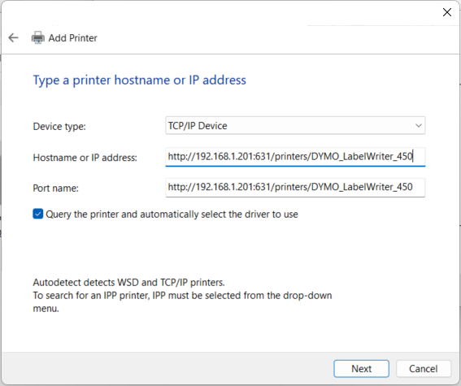
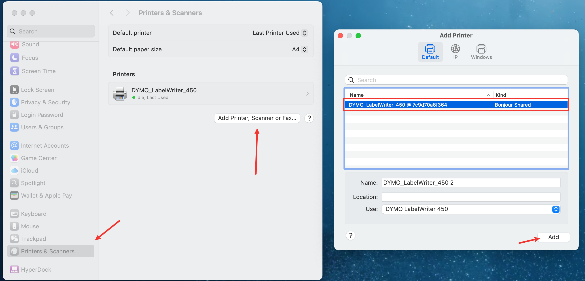
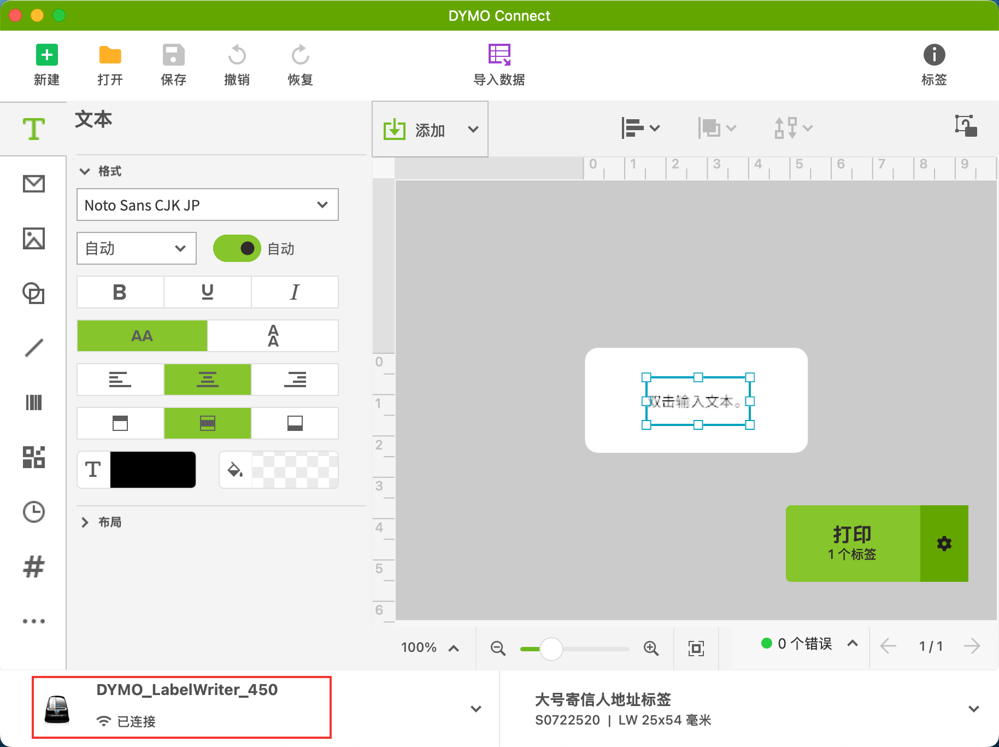

# DYMO CUPS Docker for Unraid

[![zread](https://img.shields.io/badge/Ask_Zread-_.svg?style=flat&color=00b0aa&labelColor=000000&logo=data%3Aimage%2Fsvg%2Bxml%3Bbase64%2CPHN2ZyB3aWR0aD0iMTYiIGhlaWdodD0iMTYiIHZpZXdCb3g9IjAgMCAxNiAxNiIgZmlsbD0ibm9uZSIgeG1sbnM9Imh0dHA6Ly93d3cudzMub3JnLzIwMDAvc3ZnIj4KPHBhdGggZD0iTTQuOTYxNTYgMS42MDAxSDIuMjQxNTZDMS44ODgxIDEuNjAwMSAxLjYwMTU2IDEuODg2NjQgMS42MDE1NiAyLjI0MDFWNC45NjAxQzEuNjAxNTYgNS4zMTM1NiAxLjg4ODEgNS42MDAxIDIuMjQxNTYgNS42MDAxSDQuOTYxNTZDNS4zMTUwMiA1LjYwMDEgNS42MDE1NiA1LjMxMzU2IDUuNjAxNTYgNC45NjAxVjIuMjQwMUM1LjYwMTU2IDEuODg2NjQgNS4zMTUwMiAxLjYwMDEgNC45NjE1NiAxLjYwMDFaIiBmaWxsPSIjZmZmIi8%2BCjxwYXRoIGQ9Ik00Ljk2MTU2IDEwLjM5OTlIMi4yNDE1NkMxLjg4ODEgMTAuMzk5OSAxLjYwMTU2IDEwLjY4NjQgMS42MDE1NiAxMS4wMzk5VjEzLjc1OTlDMS42MDE1NiAxNC4xMTM0IDEuODg4MSAxNC4zOTk5IDIuMjQxNTYgMTQuMzk5OUg0Ljk2MTU2QzUuMzE1MDIgMTQuMzk5OSA1LjYwMTU2IDE0LjExMzQgNS42MDE1NiAxMy43NTk5VjExLjAzOTlDNS42MDE1NiAxMC42ODY0IDUuMzE1MDIgMTAuMzk5OSA0Ljk2MTU2IDEwLjM5OTlaIiBmaWxsPSIjZmZmIi8%2BCjxwYXRoIGQ9Ik0xMy43NTg0IDEuNjAwMUgxMS4wMzg0QzEwLjY4NSAxLjYwMDEgMTAuMzk4NCAxLjg4NjY0IDEwLjM5ODQgMi4yNDAxVjQuOTYwMUMxMC4zOTg0IDUuMzEzNTYgMTAuNjg1IDUuNjAwMSAxMS4wMzg0IDUuNjAwMUgxMy43NTg0QzE0LjExMTkgNS42MDAxIDE0LjM5ODQgNS4zMTM1NiAxNC4zOTg0IDQuOTYwMVYyLjI0MDFDMTQuMzk4NCAxLjg4NjY0IDE0LjExMTkgMS42MDAxIDEzLjc1ODQgMS42MDAxWiIgZmlsbD0iI2ZmZiIvPgo8cGF0aCBkPSJNNCAxMkwxMiA0TDQgMTJaIiBmaWxsPSIjZmZmIi8%2BCjxwYXRoIGQ9Ik00IDEyTDEyIDQiIHN0cm9rZT0iI2ZmZiIgc3Ryb2tlLXdpZHRoPSIxLjUiIHN0cm9rZS1saW5lY2FwPSJyb3VuZCIvPgo8L3N2Zz4K&logoColor=ffffff)](https://zread.ai/GaryYao-Dev/dymo-cups)

This Docker setup allows sharing a DYMO LabelWriter 450 printer over LAN using CUPS.

## Files Structure

- `docker/`: Dockerfile and entrypoint script
- `scripts/`: One-click run script
- `config/`: CUPS configuration files
- `my-dymo-cups.xml`: Unraid Docker template

## Unraid Template Installation

1. On your Unraid server, run `lsusb | grep Dymo` to find the USB device:

   ```
   Bus 001 Device 011: ID 0922:0020 Dymo-CoStar Corp. LabelWriter 450
   ```

   Note the Bus and Device numbers (001/011 in this example).

2. Download `my-dymo-cups.xml` from this repository
3. Copy the file to your Unraid server's `/boot/config/plugins/dockerMan/templates-user/` directory
4. In Unraid web UI, go to Docker > Add Container
5. Select "DYMO CUPS" from the User Templates dropdown
6. Configure the settings:

   - USB Device: `/dev/bus/usb/001/011` (adjust based on your lsusb output)
   - Fixed IP: Set your desired IP address in your LAN subnet

7. Apply and start the container

## Manual Setup (Alternative)

1. Connect your DYMO LabelWriter 450 printer to the Unraid server
2. Upload the `dymo-cups` folder to your Unraid server
3. Edit `scripts/run.sh` and update the IP address:
   - Change `CONTAINER_IP="192.168.1.x"` to your desired IP in your LAN subnet
4. Run `./scripts/run.sh` in the folder (builds from project root and auto-detects USB device)
5. Access CUPS admin at `http://<container-ip>:631`
   - Username: root
   - Password: admin

## Adding Printer

**Install DYMO Connect or DYMO Label Software on your client machine to install the printer driver before adding the printer**

### Windows

1. Go to Control Panel, change view to Large icons, **right** click `Devices and Printers` , click `Open in new window`
2. Click Add a printer

   

3. Click `The printer that I want isn't listed`

   **DO NOT select the listed printer**

   

4. Select Add a printer using an IP address or hostname

   

5. `Device Type` select: `TCP/IP Device`

   `Hostname or IP address` paste the url: e.g., `http://192.168.1.201:631/printers/DYMO_LabelWriter_450`

   keep the `Port name` same as `Hostname or IP address`.

   

6. Addtional port information required page keep the default setting:

   

7. Install the printer driver page, select the right printer

   

8. Driver Version page select replace

   

9. You should be able to see the printer now is connected in the DYMO Label Software

   

### Mac

1. System Setting - Printers & Scanners - Add Printer, Scanner or Fax... - select the listed printer and hit Add

   

2. You should find the printer connted in DYMO app

   

## Note

- HTTPS certificate: Browser may warn about self-signed cert; accept it.
- Tested on mac DYMO Connect v1.5.1.15, windows DYMO Connect v1.3.2.14, windows DYMO Label v8.5.1.1913
- Only DYMO LabelWriter 450 is tested, if you have other models that doesn't have network connecting feature, [![zread](https://img.shields.io/badge/Ask_Zread-_.svg?style=flat&color=00b0aa&labelColor=000000&logo=data%3Aimage%2Fsvg%2Bxml%3Bbase64%2CPHN2ZyB3aWR0aD0iMTYiIGhlaWdodD0iMTYiIHZpZXdCb3g9IjAgMCAxNiAxNiIgZmlsbD0ibm9uZSIgeG1sbnM9Imh0dHA6Ly93d3cudzMub3JnLzIwMDAvc3ZnIj4KPHBhdGggZD0iTTQuOTYxNTYgMS42MDAxSDIuMjQxNTZDMS44ODgxIDEuNjAwMSAxLjYwMTU2IDEuODg2NjQgMS42MDE1NiAyLjI0MDFWNC45NjAxQzEuNjAxNTYgNS4zMTM1NiAxLjg4ODEgNS42MDAxIDIuMjQxNTYgNS42MDAxSDQuOTYxNTZDNS4zMTUwMiA1LjYwMDEgNS42MDE1NiA1LjMxMzU2IDUuNjAxNTYgNC45NjAxVjIuMjQwMUM1LjYwMTU2IDEuODg2NjQgNS4zMTUwMiAxLjYwMDEgNC45NjE1NiAxLjYwMDFaIiBmaWxsPSIjZmZmIi8%2BCjxwYXRoIGQ9Ik00Ljk2MTU2IDEwLjM5OTlIMi4yNDE1NkMxLjg4ODEgMTAuMzk5OSAxLjYwMTU2IDEwLjY4NjQgMS42MDE1NiAxMS4wMzk5VjEzLjc1OTlDMS42MDE1NiAxNC4xMTM0IDEuODg4MSAxNC4zOTk5IDIuMjQxNTYgMTQuMzk5OUg0Ljk2MTU2QzUuMzE1MDIgMTQuMzk5OSA1LjYwMTU2IDE0LjExMzQgNS42MDE1NiAxMy43NTk5VjExLjAzOTlDNS42MDE1NiAxMC42ODY0IDUuMzE1MDIgMTAuMzk5OSA0Ljk2MTU2IDEwLjM5OTlaIiBmaWxsPSIjZmZmIi8%2BCjxwYXRoIGQ9Ik0xMy43NTg0IDEuNjAwMUgxMS4wMzg0QzEwLjY4NSAxLjYwMDEgMTAuMzk4NCAxLjg4NjY0IDEwLjM5ODQgMi4yNDAxVjQuOTYwMUMxMC4zOTg0IDUuMzEzNTYgMTAuNjg1IDUuNjAwMSAxMS4wMzg0IDUuNjAwMUgxMy43NTg0QzE0LjExMTkgNS42MDAxIDE0LjM5ODQgNS4zMTM1NiAxNC4zOTg0IDQuOTYwMVYyLjI0MDFDMTQuMzk4NCAxLjg4NjY0IDE0LjExMTkgMS42MDAxIDEzLjc1ODQgMS42MDAxWiIgZmlsbD0iI2ZmZiIvPgo8cGF0aCBkPSJNNCAxMkwxMiA0TDQgMTJaIiBmaWxsPSIjZmZmIi8%2BCjxwYXRoIGQ9Ik00IDEyTDEyIDQiIHN0cm9rZT0iI2ZmZiIgc3Ryb2tlLXdpZHRoPSIxLjUiIHN0cm9rZS1saW5lY2FwPSJyb3VuZCIvPgo8L3N2Zz4K&logoColor=ffffff)](https://zread.ai/GaryYao-Dev/dymo-cups) to see how to change the hardcoded USB device path and other configurations base on this repo.
