# DYMO CUPS Docker for Unraid

[![zread](https://img.shields.io/badge/Ask_Zread-_.svg?style=flat&color=00b0aa&labelColor=000000&logo=data%3Aimage%2Fsvg%2Bxml%3Bbase64%2CPHN2ZyB3aWR0aD0iMTYiIGhlaWdodD0iMTYiIHZpZXdCb3g9IjAgMCAxNiAxNiIgZmlsbD0ibm9uZSIgeG1sbnM9Imh0dHA6Ly93d3cudzMub3JnLzIwMDAvc3ZnIj4KPHBhdGggZD0iTTQuOTYxNTYgMS42MDAxSDIuMjQxNTZDMS44ODgxIDEuNjAwMSAxLjYwMTU2IDEuODg2NjQgMS42MDE1NiAyLjI0MDFWNC45NjAxQzEuNjAxNTYgNS4zMTM1NiAxLjg4ODEgNS42MDAxIDIuMjQxNTYgNS42MDAxSDQuOTYxNTZDNS4zMTUwMiA1LjYwMDEgNS42MDE1NiA1LjMxMzU2IDUuNjAxNTYgNC45NjAxVjIuMjQwMUM1LjYwMTU2IDEuODg2NjQgNS4zMTUwMiAxLjYwMDEgNC45NjE1NiAxLjYwMDFaIiBmaWxsPSIjZmZmIi8%2BCjxwYXRoIGQ9Ik00Ljk2MTU2IDEwLjM5OTlIMi4yNDE1NkMxLjg4ODEgMTAuMzk5OSAxLjYwMTU2IDEwLjY4NjQgMS42MDE1NiAxMS4wMzk5VjEzLjc1OTlDMS42MDE1NiAxNC4xMTM0IDEuODg4MSAxNC4zOTk5IDIuMjQxNTYgMTQuMzk5OUg0Ljk2MTU2QzUuMzE1MDIgMTQuMzk5OSA1LjYwMTU2IDE0LjExMzQgNS42MDE1NiAxMy43NTk5VjExLjAzOTlDNS42MDE1NiAxMC42ODY0IDUuMzE1MDIgMTAuMzk5OSA0Ljk2MTU2IDEwLjM5OTlaIiBmaWxsPSIjZmZmIi8%2BCjxwYXRoIGQ9Ik0xMy43NTg0IDEuNjAwMUgxMS4wMzg0QzEwLjY4NSAxLjYwMDEgMTAuMzk4NCAxLjg4NjY0IDEwLjM5ODQgMi4yNDAxVjQuOTYwMUMxMC4zOTg0IDUuMzEzNTYgMTAuNjg1IDUuNjAwMSAxMS4wMzg0IDUuNjAwMUgxMy43NTg0QzE0LjExMTkgNS42MDAxIDE0LjM5ODQgNS4zMTM1NiAxNC4zOTg0IDQuOTYwMVYyLjI0MDFDMTQuMzk4NCAxLjg4NjY0IDE0LjExMTkgMS42MDAxIDEzLjc1ODQgMS42MDAxWiIgZmlsbD0iI2ZmZiIvPgo8cGF0aCBkPSJNNCAxMkwxMiA0TDQgMTJaIiBmaWxsPSIjZmZmIi8%2BCjxwYXRoIGQ9Ik00IDEyTDEyIDQiIHN0cm9rZT0iI2ZmZiIgc3Ryb2tlLXdpZHRoPSIxLjUiIHN0cm9rZS1saW5lY2FwPSJyb3VuZCIvPgo8L3N2Zz4K&logoColor=ffffff)](https://zread.ai/GaryYao-Dev/dymo-cups)

This Docker setup allows sharing a DYMO LabelWriter 450 printer over LAN using CUPS.

DYMO LabelWriter 450 is tested, if you have other models that doesn't have network connecting feature, click the `Ask Zread` badge above to see how to change the hardcoded USB device path and other configurations base on this repo.

This configuration is compatible with DYMO Label Software and DYMO Connect on Windows and Mac.

## Files Structure

- `docker/`: Dockerfile and entrypoint script
- `scripts/`: One-click run script
- `config/`: CUPS configuration files
- `my-dymo-cups.xml`: Unraid Docker template

## Unraid Template Installation

1. Download `my-dymo-cups.xml` from this repository
2. Copy the file to your Unraid server's `/boot/config/plugins/dockerMan/templates-user/` directory
3. In Unraid web UI, go to Docker > Add Container
4. Select "DYMO CUPS" from the User Templates dropdown
5. Configure the settings:

   - **Fixed IP**: Set your desired IP address in your LAN subnet (e.g., 192.168.1.201)
   - **USB Devices**: Keep default `/dev/bus/usb` (enables auto-detection)
   - **Privileged**: Must be enabled (should be set by template)

6. Apply and start the container

**✨ Auto-Detection Feature**: The container automatically detects your DYMO printer on startup - no manual device path configuration needed! Works across reboots.

## Manual Setup (Alternative)

1. Connect your DYMO LabelWriter printer to the Unraid server
2. Upload the `dymo-cups` folder to your Unraid server
3. Edit `scripts/run.sh` and update the IP address:
   - Change `CONTAINER_IP="192.168.1.x"` to your desired IP in your LAN subnet
4. Run `./scripts/run.sh` in the folder
   - Automatically builds image and detects USB device
   - No manual device path configuration needed!
5. Access CUPS admin at `http://<container-ip>:631`
   - Username: root
   - Password: admin

## Adding Printer

**Install DYMO Label Software on your client machine to install the printer driver before adding the printer**

### Windows

1. Go to Control Panel, change view to Large icons, **right** click `Devices and Printers` , click `Open in new window`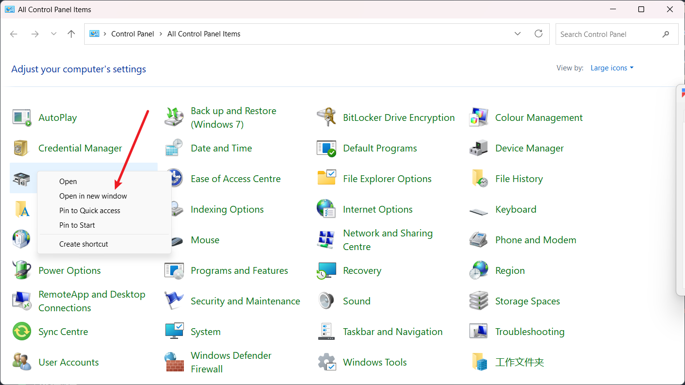
2. Click Add a printer

   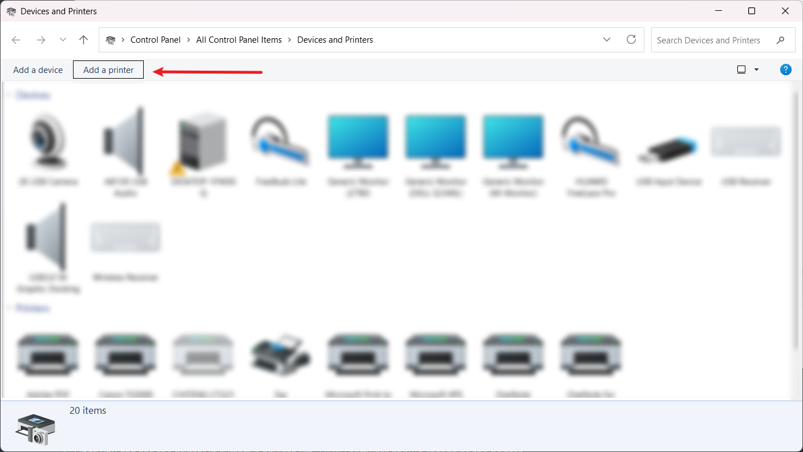

3. Click `The printer that I want isn't listed`

   **DO NOT select the listed printer**

   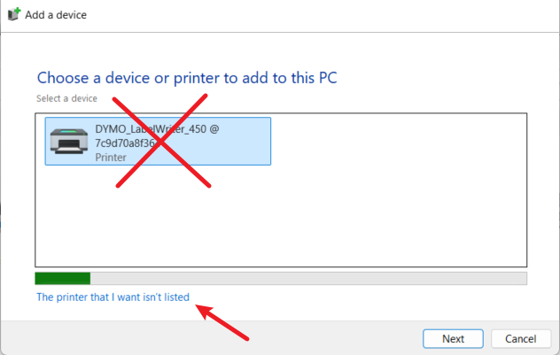

4. Select `Select a shared printer by name`
5. Paste the url: e.g., `http://192.168.1.201:631/printers/DYMO_LabelWriter_450

   `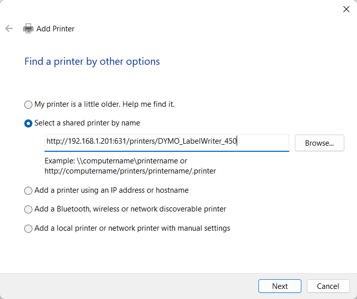

   Then you should be able to find the printer in DYMO legacy apps.

   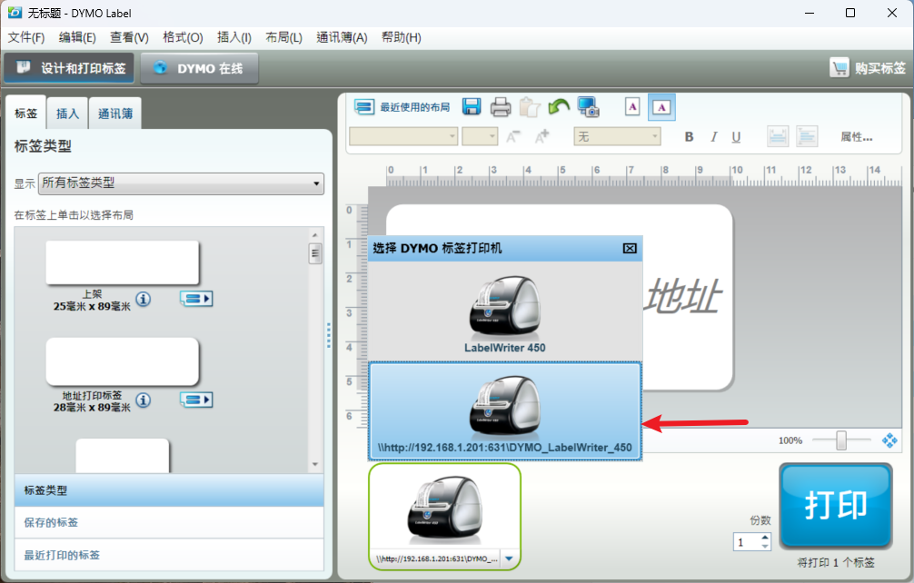

   #### Additional steps to add printer in DYMO connect

   > It seems the `http` prefix in printer name is blocked by DYMO connect, the following steps are to create a new printer with acceptable name using the port generated above.

6. follow the step 2 & 3 to add a printer again and select `Add a local printer or network printer with manual settings`

   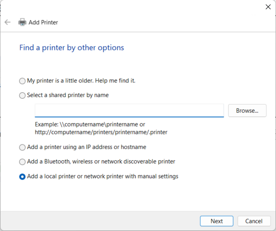

7. Select the existing port that you created in step 5 (the port must be **Internet Port**)

   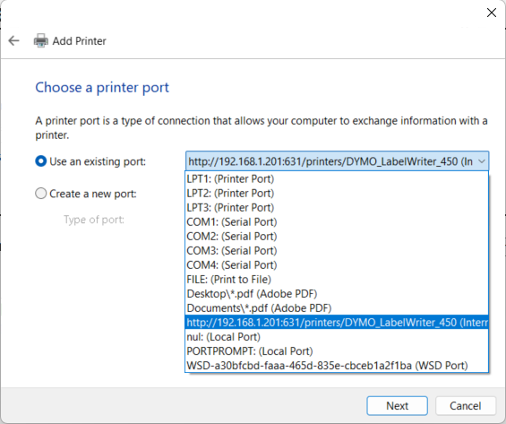

   > After the selecting the port , you can remove the printer generated in step 5 so that the unavailable printer(the name started with `http` ) is removed from DYMO connect

8. Select the corrent driver and select replace the current driver.

   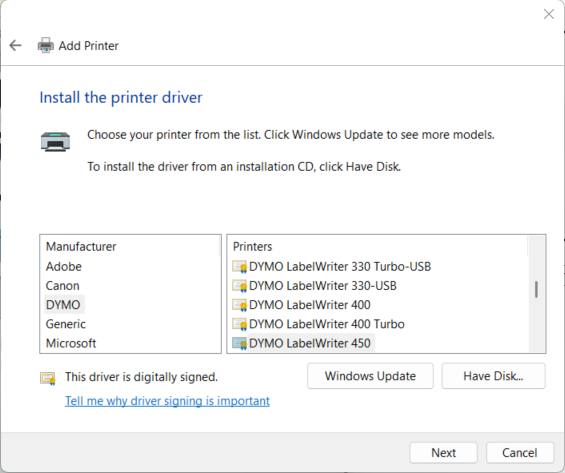

   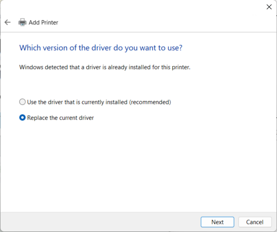

   You should be able to use it in DYMO Connect now

   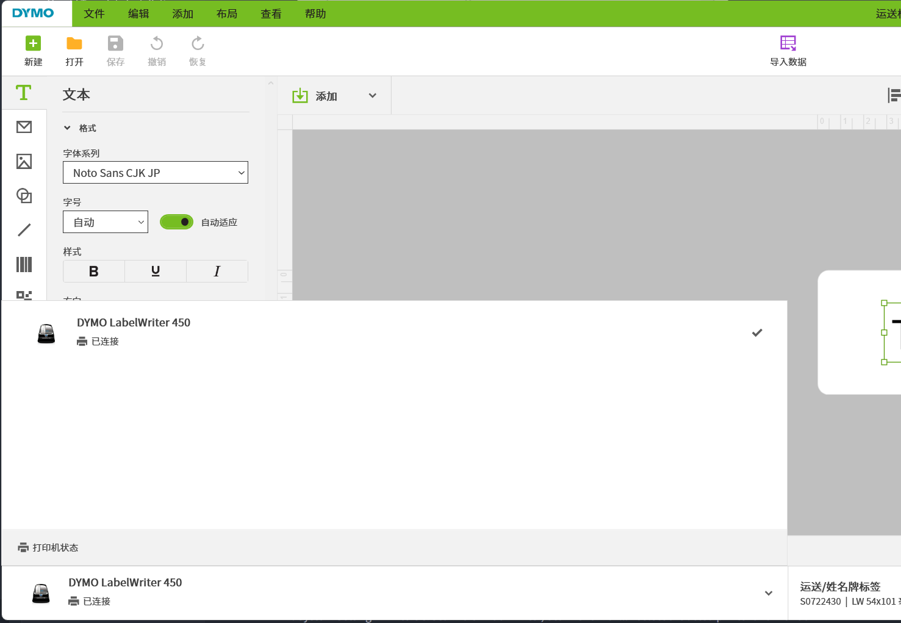

### Mac

1. System Setting - Printers & Scanners - Add Printer, Scanner or Fax... - select the listed printer and hit Add

   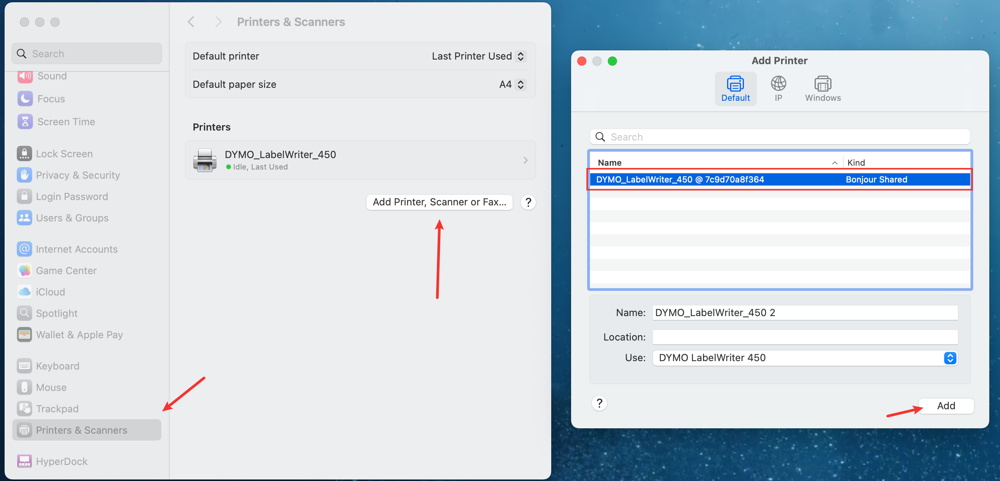

2. You should find the printer connted in DYMO app

   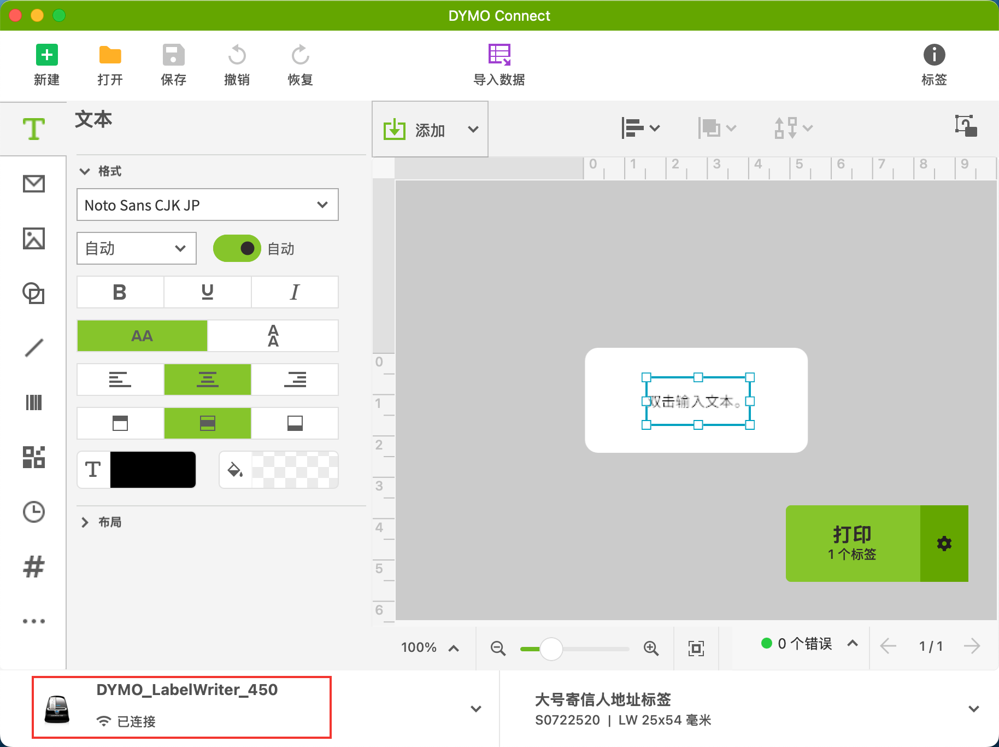

## Note

- HTTPS certificate: Browser may warn about self-signed cert; accept it.
- Tested on mac DYMO Connect v1.5.1.15, windows DYMO Label v8.5.1.1913, windows DYMO Connect v1.5.1.20
